# Exploratory Data Analysis — Sen1Floods11

Full EDA of the [Sen1Floods11](https://github.com/cloudtostreet/Sen1Floods11) dataset for binary flood segmentation from Sentinel-1 SAR imagery. All analysis is in `eda.ipynb`; key plots and findings are documented below.

---

## 1. Dataset Overview

Sen1Floods11 provides globally distributed flood event imagery with two label tiers:

- **HandLabeled:** 446 chips — clean, human-drawn binary flood masks. Used for training and evaluation.
- **WeaklyLabeled:** 4,384 chips — automated labels derived from Otsu thresholding on Sentinel-1 and Sentinel-2. Potentially useful for pretraining or semi-supervised learning, but not used in our current pipeline.

Each chip is 512x512 pixels at 10m spatial resolution and comes with:
- **Sentinel-1 SAR** (2 bands: VV, VH) — float32, GeoTIFF
- **Sentinel-2 Optical** (13 bands: B1–B12) — uint16, GeoTIFF
- **Label mask** — values: `1` (flood), `0` (non-flood), `-1` (invalid/no-data)

The dataset spans 11 countries across different continents and flood types:

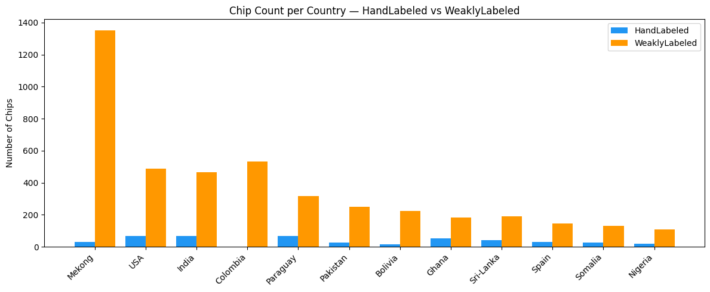

---

## 2. Sample Visualization

A single chip from Bolivia showing all available data layers:

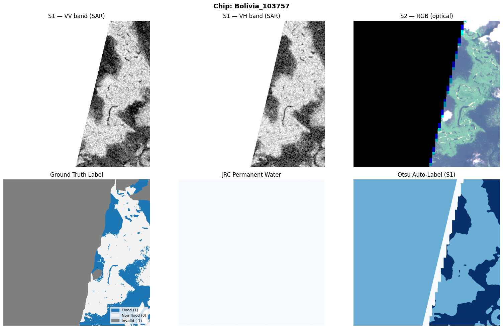

- **S1 VV / VH:** SAR backscatter intensity. Flood water appears as dark regions (low backscatter) because smooth water surfaces reflect radar energy away from the sensor.
- **S2 RGB:** Optical true-color composite. Useful for visual context but often obscured by clouds during flood events — this is why SAR is preferred.
- **Label:** Human-annotated flood mask. Grey regions are invalid pixels (label = -1), masked during training.
- **JRC Water:** Permanent water body mask from the JRC Global Surface Water dataset.
- **Otsu:** Automatically generated flood label via Otsu thresholding on SAR.

### Cross-Country Comparison

Comparing S1 VV and labels across 4 different countries shows the diversity of flood signatures — different land cover, flood extent, and SAR response:

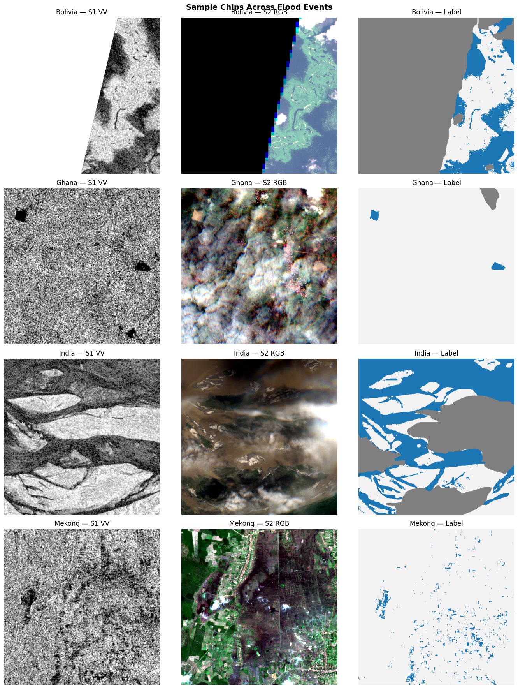

---

## 3. Class Imbalance

Class imbalance is the single biggest challenge in this dataset.

**Pixel-level breakdown (all 446 HandLabeled chips):**

| Class | Pixels | Percentage |
|-------|--------|------------|
| Non-flood (0) | 90,277,709 | 77.2% |
| Flood (1) | 10,705,605 | 9.2% |
| Invalid (-1) | 15,932,910 | 13.6% |

**Chip-level statistics:**
- Mean flood coverage per chip: **10.7%**
- Chips with >50% flood: **27** out of 446
- Chips with 0% flood: **52** out of 446

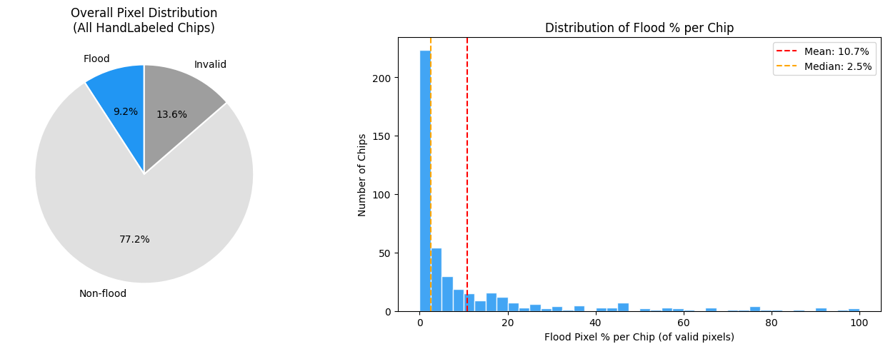

**Implication:** Standard BCE loss alone would converge to predicting "non-flood" everywhere. We use a combined **Dice + BCE loss** (equal weights) to handle this — Dice loss directly optimizes the overlap metric and is less sensitive to class imbalance.

### Per-Country Flood Ratio

Flood coverage varies significantly by country/event. Some regions are almost entirely non-flood, while others have substantial flooding:

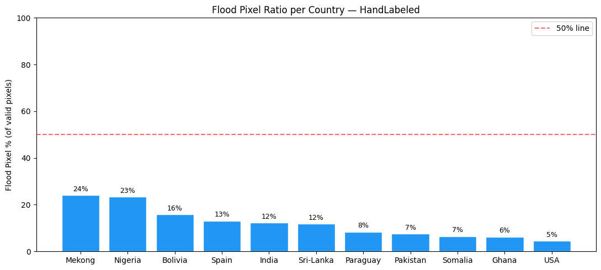

---

## 4. SAR Backscatter Analysis

This is the core question: **can Sentinel-1 SAR distinguish flood water from land?**

### VV and VH Band Distributions

Aggregated over 50 random chips, separating flood vs. non-flood pixels:

| Metric | Flood | Land | Separation |
|--------|-------|------|------------|
| Mean VV (dB) | -17.06 | -9.84 | **7.22 dB** |
| Mean VH (dB) | -24.99 | -16.35 | **8.63 dB** |
| Mean VV−VH (dB) | 7.93 | 6.52 | 1.41 dB |
| Std VV | 5.19 | 3.16 | — |
| Std VH | 6.49 | 3.37 | — |

Flood water produces significantly lower backscatter in both polarizations. The separation is large (>7 dB) relative to the within-class variance, confirming SAR is highly informative for this task.

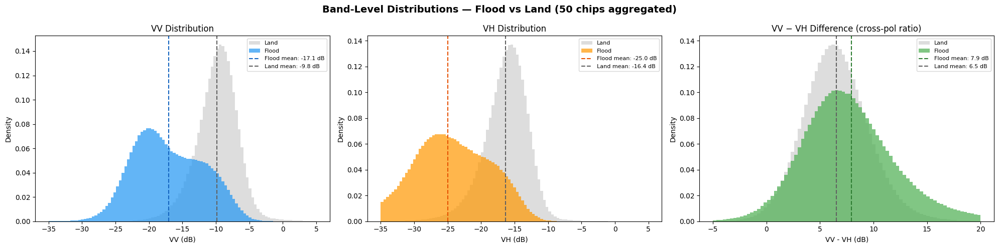

### VV vs VH Feature Space

Scatter plot of VV vs VH values for flood and land pixels. The two classes form distinct clusters in band space, though with some overlap — motivating a learned model rather than a simple threshold:

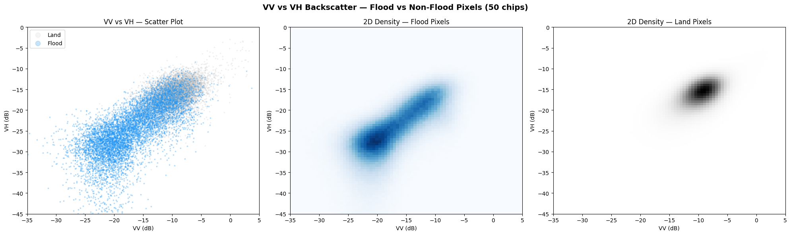

### Per-Country Consistency

The backscatter separation between flood and land holds consistently across all countries in the dataset. This is important for generalization — the signal isn't specific to one geography:

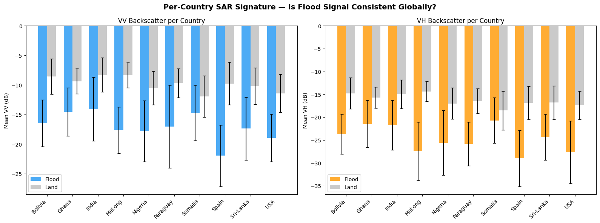

### Normalization Constants

Computed from 30 random chips for input normalization during training:

| Band | Mean | Std |
|------|------|-----|
| VV | -10.41 dB | 4.14 |
| VH | -17.14 dB | 4.68 |

---

## 5. Flood Water vs Permanent Water Bodies

An important nuance: **permanent water bodies (lakes, rivers) also have low SAR backscatter**, similar to flood water. The JRC Global Surface Water mask helps distinguish them.

Average backscatter comparison:

| Surface Type | Mean VV (dB) | Std |
|--------------|-------------|-----|
| Flood water | -17.99 | 5.71 |
| Permanent water (JRC) | -19.78 | 5.79 |
| Land (non-flood) | -9.78 | 3.23 |

Flood and permanent water have very similar SAR signatures (~2 dB difference), while both are ~8–10 dB lower than land. This means a purely SAR-based model may confuse permanent water with flood water. For our current task this is acceptable since the labels already account for it, but it's worth noting for downstream applications.

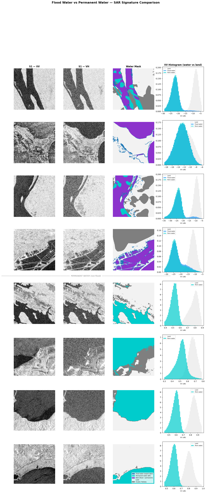

---

## 6. Expert Labels vs Otsu Auto-Labels

The WeaklyLabeled chips use Otsu thresholding to generate automatic flood masks. How good are they compared to expert annotations?

**Short answer: inconsistent.** On some chips the auto-label is excellent (IoU > 0.87), while on others it completely fails (IoU = 0.0). This is expected — Otsu is a global threshold method that assumes a bimodal histogram, which doesn't hold for all scenes.

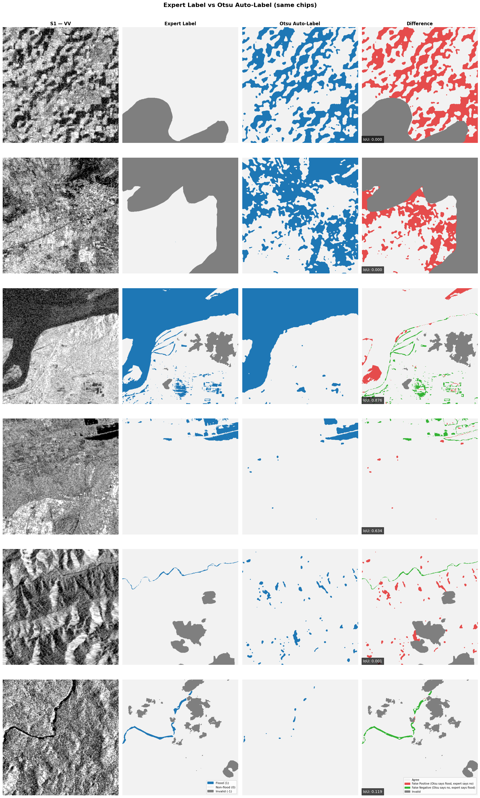

The difference maps show: white = agreement, red = false positive (Otsu says flood, expert says no), green = false negative (Otsu misses flood), grey = invalid.

**Implication:** WeaklyLabeled data should be used cautiously. It's fine for pretraining or noisy supervision, but final evaluation must use HandLabeled chips only.

---

## 7. Random Chip Survey

10 randomly selected chips showing the range of scenes in the dataset — varying flood extent, land cover, and SAR texture:

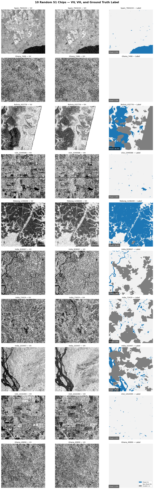

---

## Summary of Findings

| Finding | Design Decision |
|---------|-----------------|
| Flood = 9% of pixels, severe class imbalance | Use Dice + BCE combined loss |
| SAR backscatter separates flood from land by >7 dB | S1 VV+VH is sufficient input; S2 optical not needed |
| Separation is consistent across countries | Model should generalize; Bolivia held-out test is meaningful |
| Permanent water ≈ flood water in SAR | Acceptable for binary segmentation; note for applications |
| Otsu auto-labels are unreliable | Train/evaluate on HandLabeled only |
| 13.6% invalid pixels | Mask label=-1 during loss computation |
| 512x512 at 10m resolution | Feed directly to U-Net, no tiling needed |
| VV mean=-10.41, std=4.14; VH mean=-17.14, std=4.68 | Per-band z-score normalization |
